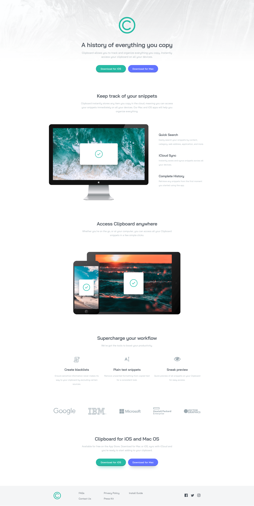

# Frontend Mentor - Clipboard landing page solution

This is a solution to the [Clipboard landing page challenge on Frontend Mentor](https://www.frontendmentor.io/challenges/clipboard-landing-page-5cc9bccd6c4c91111378ecb9). Frontend Mentor challenges help you improve your coding skills by building realistic projects.

## Table of contents

- [Overview](#overview)
  - [The challenge](#the-challenge)
  - [Screenshot](#screenshot)
  - [Links](#links)
- [My process](#my-process)
  - [Built with](#built-with)
  - [What I learned](#what-i-learned)
  - [Continued development](#continued-development)
  - [Useful resources](#useful-resources)
- [Author](#author)

## Overview

### The challenge

Users should be able to:

- View the optimal layout for the site depending on their device's screen size
- See hover states for all interactive elements on the page

### Screenshot

### Links

- Solution URL: [GitHub](https://github.com/GrzywN/clipboard-landing-page-master)
- Live Site URL: [Netlify](https://effortless-lolly-6cfafa.netlify.app/)

## My process

### Built with

- Semantic HTML5 markup
- CSS3 with SCSS
- Flexbox / CSS Grid
- Mobile-first workflow
- BEM
- Vanilla Javascript
- GSAP && ScrollTrigger for animations

### What I learned

I learned a lot about GSAP and OOP in JavaScript. Also now I'm better at using import/export modules.

### Continued development

Maybe I'll come back in the future to improve this project.

### Useful resources

- [Introducing ScrollTrigger for GSAP](https://youtu.be/X7IBa7vZjmo)
- [Understanding ScrollTrigger.matchMedia()](https://youtu.be/R7-3oEiDaZo)
- [Clean Code](https://www.udemy.com/course/writing-clean-code/)

## Author

- Frontend Mentor - [@grzywn](https://www.frontendmentor.io/profile/grzywn)
- Twitter - [@grzywn](https://www.twitter.com/grzywn)
